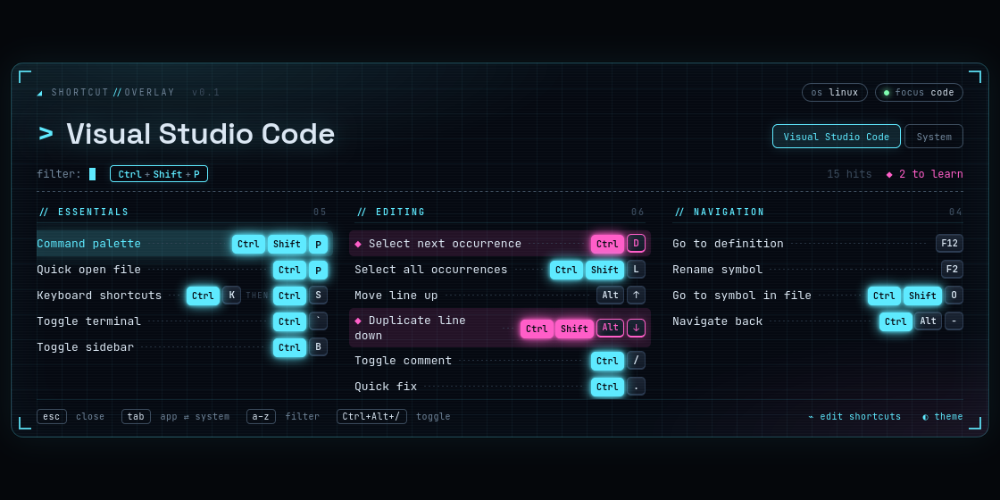
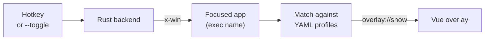

<div align="center">

# Shortcut Overlay

**A cross-platform HUD that shows the most useful keyboard shortcuts of the app you are working in**


[](https://github.com/HuberNicolas/shortcut-overlay/actions/workflows/ci.yml)
[](LICENSE)

[Quick start](#quick-start) · [Usage](#usage) · [Custom shortcuts](#custom-shortcuts) · [Configuration](#configuration)

</div>

---

Press a hotkey and Shortcut Overlay detects which application has focus, then shows its most useful shortcuts
in a translucent overlay. It ships with profiles for common tools, falls back to system shortcuts, and lets you add
your own profiles and mark the shortcuts you want to learn. The app is small (a few MB), sits in the tray, and
runs on Ubuntu, macOS and Windows.

<div align="center">



</div>

## Features

- 🎯 **Focus detection**: shows the profile of the focused app, or system shortcuts if there is none
- ⌨️ **Live keys**: held keys light up; when you hold exactly one shortcut, its row is highlighted
- 🔎 **Type to filter** by action or key, <kbd>Tab</kbd> switches between app and system shortcuts
- 🎨 **Theming**: primary and secondary color, six presets or hue sliders
- 📚 **Learning**: `learn: true` marks shortcuts you want to practice in the secondary color
- 📝 **Custom profiles** as YAML files, reloaded every time the overlay opens
- 💻 **Per-OS keys**: `Mod` becomes <kbd>Ctrl</kbd> or <kbd>⌘</kbd>, with optional overrides per system

Built-in profiles:

| Profile           | Matches                                                        |
|-------------------|----------------------------------------------------------------|
| **System**        | Fallback for every app: windows, workspaces, screenshots       |
| **VS Code**       | Visual Studio Code, VSCodium, Code - OSS                       |
| **Firefox**       | Firefox, LibreWolf, Zen                                        |
| **Chrome**        | Chrome, Chromium, Brave, Edge, Vivaldi, Opera                  |
| **Terminal**      | GNOME Terminal, Ptyxis, Konsole, Kitty, iTerm2, Windows Terminal, … |
| **File manager**  | Nautilus, Dolphin, Finder, Explorer, …                         |
| **JetBrains IDE** | IntelliJ IDEA, PyCharm, WebStorm, GoLand, Rider, RustRover, …  |
| **Slack**         | Slack                                                          |

> [!NOTE]
> GNOME on Wayland does not let apps read the focused window or register global hotkeys. Shortcut Overlay installs a
> small GNOME Shell extension for focus detection (active after the next login), and you bind the hotkey in the GNOME
> settings. See [Ubuntu with GNOME on Wayland](#ubuntu-with-gnome-on-wayland).

## Contents

- [Tech stack](#tech-stack)
- [How it works](#how-it-works)
- [Repository structure](#repository-structure)
- [Quick start](#quick-start)
- [Usage](#usage)
- [Custom shortcuts](#custom-shortcuts)
- [Configuration](#configuration)
- [Development](#development)
- [Release](#release)
- [License](#license)
- [Author](#author)

## Tech stack

| Area         | Technologies |
|--------------|--------------|
| **App**      |   [`x-win`](https://crates.io/crates/x-win) (focus detection)  |
| **Overlay**  |    JetBrains Mono, Space Grotesk |
| **CI/CD**    |  [`tauri-action`](https://github.com/tauri-apps/tauri-action) |

## How it works



1. The app runs in the background with a tray icon. A global hotkey, or a second launch with `--toggle`, toggles the
   overlay; the second launch only forwards the signal to the running instance.
2. **Before** the overlay is shown, the backend reads the focused app. Otherwise the overlay would detect itself.
3. The executable and app name are compared with the `match` lists of all profiles. Built-in profiles are compiled
   into the binary; user files override or extend them.
4. The overlay receives the profile, the system profile and the theme, and renders them.

## Repository structure

| Path                                                    | Content                                                         |
|---------------------------------------------------------|-----------------------------------------------------------------|
| [`src/`](src)                                           | Vue overlay: [`App.vue`](src/App.vue), key labels, theme presets |
| [`src/components/`](src/components)                     | `KeyCombo` (keycaps) and `ThemePicker`                          |
| [`src-tauri/src/lib.rs`](src-tauri/src/lib.rs)          | Window, tray, hotkey, `--toggle`, config                        |
| [`src-tauri/src/focus.rs`](src-tauri/src/focus.rs)      | Focus detection and the GNOME extension                         |
| [`src-tauri/src/shortcuts.rs`](src-tauri/src/shortcuts.rs) | Loading, resolving and matching the YAML profiles            |
| [`src-tauri/shortcuts/`](src-tauri/shortcuts)           | Built-in profiles                                               |
| [`.github/workflows/`](.github/workflows)               | CI (build and tests) and the release build for all systems      |
| [`PLAN.md`](PLAN.md)                                    | Decisions, status and ideas                                     |

## Quick start

### Prerequisites

- [Rust](https://rustup.rs) (stable)
- [Node.js](https://nodejs.org) 20 or newer
- On Ubuntu, the Tauri system libraries:

```bash
sudo apt install -y libwebkit2gtk-4.1-dev libxdo-dev libssl-dev libayatana-appindicator3-dev librsvg2-dev
```

### 1. Clone and install

```bash
git clone git@github.com:HuberNicolas/shortcut-overlay.git
cd shortcut-overlay
npm install
```

### 2. Run it

**Development mode** with live reload (keep the terminal open):

```bash
npm run tauri dev
```

**Standalone binary** without installing anything:

```bash
npm run tauri build -- --no-bundle
./src-tauri/target/release/shortcut-overlay &
```

**Installer** (`.deb`, `.AppImage`, `.dmg`, `.msi`, depending on the system):

```bash
npm run tauri build
```

The packages are in `src-tauri/target/release/bundle/`.

## Usage

| Key                                         | Action                              |
|---------------------------------------------|-------------------------------------|
| <kbd>Ctrl</kbd>+<kbd>Alt</kbd>+<kbd>/</kbd> | Toggle the overlay (macOS: <kbd>⌘</kbd><kbd>⌥</kbd><kbd>/</kbd>) |
| <kbd>a</kbd>–<kbd>z</kbd>                   | Filter                              |
| <kbd>Tab</kbd>                              | Switch between app and system       |
| <kbd>Esc</kbd>                              | Clear the filter, then close        |
| Hold any keys                               | Light up matching keycaps           |

The overlay also closes when it loses focus. The tray menu can show the overlay, open the shortcuts folder, and quit.

### Ubuntu with GNOME on Wayland

1. **Focus detection**: the first start installs the GNOME Shell extension `x-win@miniben90.org`.
   **Log out and back in once** to activate it.
2. **Hotkey**: open *Settings → Keyboard → View and Customize Shortcuts → Custom Shortcuts*, add a shortcut with the
   command `/path/to/shortcut-overlay --toggle` and pick a key, for example <kbd>Super</kbd>+<kbd>/</kbd>.

On GNOME the overlay runs through XWayland, which lets it stay on top and be centered.

## Custom shortcuts

Profiles live in the shortcuts folder, which you can open from the tray or with *edit shortcuts* in the overlay:

| System  | Folder                                                                   |
|---------|--------------------------------------------------------------------------|
| Linux   | `~/.config/dev.hubernicolas.shortcut-overlay/shortcuts/`                 |
| macOS   | `~/Library/Application Support/dev.hubernicolas.shortcut-overlay/shortcuts/` |
| Windows | `%APPDATA%\dev.hubernicolas.shortcut-overlay\shortcuts\`                 |

A file with the `id` of a built-in profile replaces it; a new `id` adds a profile.

```yaml
id: obsidian
name: Obsidian
match: [obsidian]                  # executable or app name, shown as "focus" in the overlay
groups:
  - name: Notes
    shortcuts:
      - { keys: "Mod+O", action: "Quick switcher" }             # Mod = Ctrl, or Cmd on macOS
      - { keys: "Mod+P", action: "Command palette", learn: true }
      - { keys: "Mod+K Mod+S", action: "Two steps in a row" }
      - { keys: "Ctrl+Tab", mac: "Cmd+Alt+Right", action: "Different key on macOS" }
      - { keys: "Super+E", action: "Only on Windows", os: [windows] }
```

| Field                        | Meaning                                                      |
|------------------------------|--------------------------------------------------------------|
| `keys`                       | Keys joined with `+`; a space separates steps of a sequence  |
| `mac` / `linux` / `windows`  | Replace `keys` on that system                                |
| `os`                         | Show the shortcut only on these systems                      |
| `learn`                      | Highlight the shortcut in the secondary color                |

Key names: `Mod`, `Ctrl`, `Alt`, `Shift`, `Super`, `Cmd`, `Plus`, `Enter`, `Space`, `Tab`, `Esc`, `Up`, `F12`, …

## Configuration

`config.yaml` sits next to the shortcuts folder. The theme picker in the overlay writes it; you can also edit it by hand.

```yaml
hotkey: CommandOrControl+Alt+Slash
theme:
  primary: "#5eeaff"    # interface and held keys
  secondary: "#ff5ec8"  # shortcuts with learn: true
```

The hotkey uses the [Tauri accelerator format](https://v2.tauri.app/plugin/global-shortcut/) and is read at startup.

## Development

| Command                                               | Purpose                                              |
|-------------------------------------------------------|------------------------------------------------------|
| `npm run tauri dev`                                   | Run the app with live reload                         |
| `npm run dev`                                         | Only the overlay in the browser, with sample data    |
| `npx vue-tsc --noEmit`                                | Type-check the frontend                              |
| `cargo test --manifest-path src-tauri/Cargo.toml`     | Test profile parsing and matching                    |

In browser mode, `http://localhost:1420/?still&hold=Ctrl+Shift+P` turns off the animations and shows keys as held,
which is how the screenshot above was made.

## Release

Pushing a tag such as `v0.1.0` starts the [release workflow](.github/workflows/release.yml). It builds installers for
Linux, macOS (universal) and Windows and attaches them to a draft GitHub release.

```bash
git tag v0.1.0 && git push origin v0.1.0
```

## License

The code is released under the [MIT License](LICENSE). The bundled fonts (JetBrains Mono, Space Grotesk) and all
libraries keep their own licenses.

## Author

Nicolas Huber · [nicolas.huber.dev@gmail.com](mailto:nicolas.huber.dev@gmail.com) ·
[GitHub](https://github.com/HuberNicolas)
